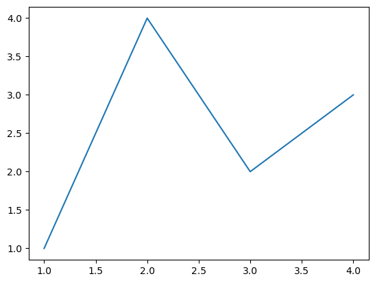

# example_outputs

```python
import matplotlib.pyplot as plt
```

# Image

```python
fig, ax = plt.subplots()             # Create a figure containing a single Axes.
ax.plot([1, 2, 3, 4], [1, 4, 2, 3])  # Plot some data on the Axes.
plt.show()
```



## SVG

```python
svg = """<svg height="100" width="100" xmlns="http://www.w3.org/2000/svg"><circle cx="50" cy="50" r="40" stroke="black"></circle></svg>"""

class SVG:
    def _repr_svg_(self):
        return svg

display(SVG())
```


### Text

```python
for i in range(10):
    print(i)
```

```
0
1
2
3
4
5
6
7
8
9

```

#### Latex


```python
latex = "$$e^{i\\pi}+1=0$$"

class Latex:
    def _repr_latex_(self):
        return latex

display(Latex())
```

$$e^{i\pi}+1=0$$

##### HTML

```python
import pandas
pandas.DataFrame(data={"col1": [1, 2], "col2": [3, 4]})
```

<div>
<style scoped>
    .dataframe tbody tr th:only-of-type {
        vertical-align: middle;
    }

    .dataframe tbody tr th {
        vertical-align: top;
    }

    .dataframe thead th {
        text-align: right;
    }
</style>
<table border="1" class="dataframe">
  <thead>
    <tr style="text-align: right;">
      <th></th>
      <th>col1</th>
      <th>col2</th>
    </tr>
  </thead>
  <tbody>
    <tr>
      <th>0</th>
      <td>1</td>
      <td>3</td>
    </tr>
    <tr>
      <th>1</th>
      <td>2</td>
      <td>4</td>
    </tr>
  </tbody>
</table>
</div>
